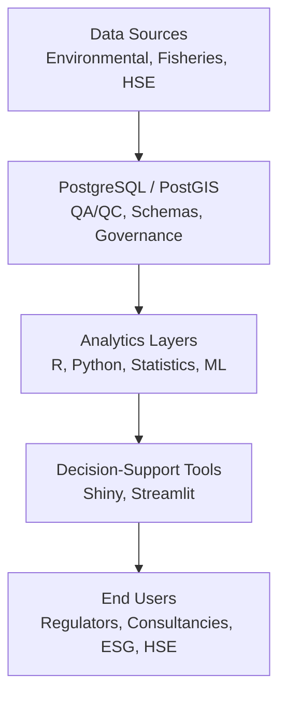
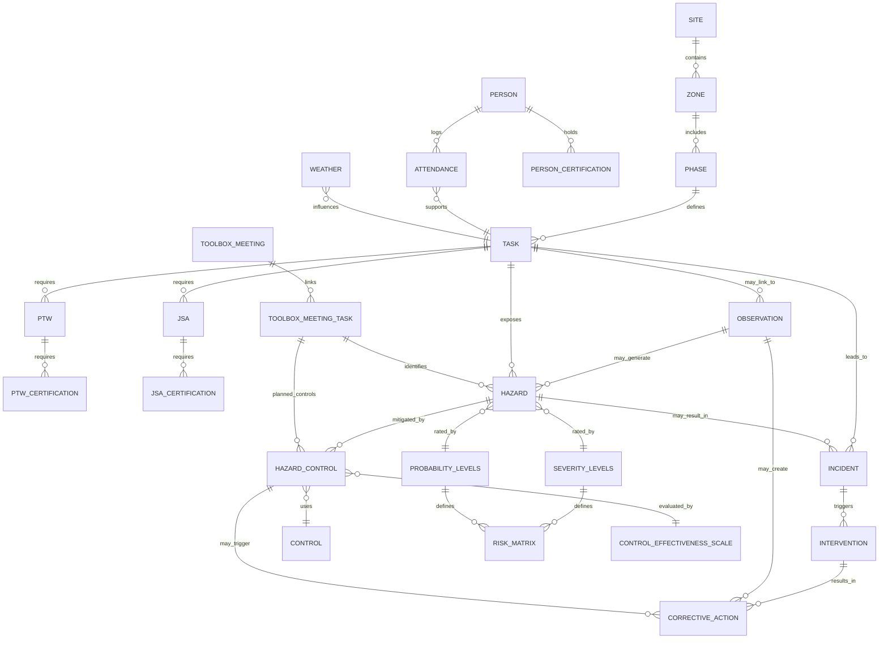

# Hi, I’m Euchie 👋🌱

> *“A stitch in time saves nine.”*  
> I build **risk-aware, decision-support tools** that turn complex environmental, spatial, and safety data into **early warnings and defensible insights**.

I'm an **interdisciplinary environmental scientist and applied data practitioner** with a foundation in business, which informs my structured, outcome-oriented approach to turning complex environmental, spatial, and safety data into actionable insights.  
Trained academically in Asia and with hands-on experience in **regulated industrial environments**, my work sits at the intersection of **environmental science, spatial analytics, and applied risk intelligence**, with a focus on **monitoring, prioritization, and prevention**.  

---

## 🎓 Background
- Marine Environmental Science + Applied Data Science 
  - MSc Biodiversity — National Taiwan University (Taiwan)
- Originally trained in business, bringing operational insight and analytical rigor to environmental data and decision-support work.
- Currently based in **Saint Lucia**

---

## 💡 What I Do
I design **decision tools**, not just analyses.

That means:
- validating data before interpreting it
- making uncertainty explicit
- translating outputs into **screening-level intelligence** people can actually use

Target environments include:
**environmental consultancies, regulators, NGOs, sustainability teams, and applied data groups**.

---

## 🧩 Decision-Support Architecture
Across projects, I follow a consistent decision-support architecture that emphasizes data credibility, traceability, and operational relevance.

*From raw data to defensible decisions in regulated and high-uncertainty environments.*

---

## 🧭 Flagship Decision-Support Projects

### 🦑 SquidStack
**Environmental Contaminants & Human Health Screening**  
Interactive **R Shiny dashboards** translating marine pollution data into **risk-aware insights**.

**Decision flow:**
- QA/QC & data credibility
- Pattern detection & prioritization
- Temporal trend analysis (incl. COVID-era effects)
- Human health screening (EDI / HQ)

[*More about SquidStack*](https://github.com/Euchie23/SquidStack/)  

🔗 Apps:  
- 🧱 [Foundation](https://euchie23.shinyapps.io/foundation/) 
- 🧪 [Exploration](https://euchie23.shinyapps.io/exploration/) 
- 📈 [Fluctuations](https://euchie23.shinyapps.io/fluctuation/) 
- ⚠️ [Risk Evaluation](https://euchie23.shinyapps.io/risk_evaluation/)
  
---

### 📈 SquidStock
**Fisheries Dynamics & Risk-Aware Modeling**  

Python & Streamlit tools supporting **stock assessment and planning under uncertainty**.

Includes:
- CPUE standardization (GAMs, Tweedie)
- Biomass simulation (EDSPM-style models)
- Scenario-aware forecasting
- Exploratory ML with explicit validation limits

[*More about SquidStock*](https://github.com/Euchie23/SquidStock/) 

🔗 Apps / Notebooks:  
- 📈 [Temporal CPUE Analysis](https://github.com/Euchie23/SquidStock/blob/main/notebooks/Temporal_Catch_Analysis/Temporal_Catch_Analysis.ipynb) 
- 📊 [CPUE Standardization & Prediction](https://squidstock-course-correction.streamlit.app) 
- 🌡️ [Biomass Simulation under Warming Scenarios](https://squidstock-ocean-dynamics.streamlit.app)
- ⚙️ [Predictive Squid Catch Models using AutoML](https://squidstock-the-engine-room.streamlit.app)

---

### 🌍 GeoTentacles 
**Spatial Intelligence for Marine Systems**  

PostgreSQL/PostGIS-driven spatial analytics for **monitoring, hotspot detection, and planning**.

Highlights:
- 20+ years of spatio-temporal hotspot analysis
- Probabilistic hotspot prediction (ML)
- PostgreSQL + PostGIS backend  
- Shiny apps deployed using **Neon (serverless PostgreSQL)**

[*More about GeoTentacles*](https://github.com/Euchie23/GeoTentacles/)  

🔗 App(s):  
- [🗺️ **Hotspots — Historical and Predicted Squid Hotpots**](<https://euchie23.shinyapps.io/geotentacles__hotspots/>)
- 🌎 Marine Scope - A spatial marine health app for analyzing pollution, ecosystem condition, and environmental change *(Coming Soon)*

---

## 🦺 HSE–Q Risk Intelligence (Personal Project)

Alongside my current role as **Contracted HSE-Q Support** on a **regulated oil & gas infrastructure construction project**, I am building a **professional-grade HSE–Q risk intelligence system**.

**System scope:**
- PostgreSQL schema (DDL)
- Reproducible risk scoring logic (SQL)
- Shiny dashboard wireframes
- ML-ready feature design (future)

📌 **Conceptual Risk Intelligence Model**  

Below is a high-level, operational risk intelligence ERD diagram showing how risk information flows through the system.

📘 System Logic, Data Entry Rules, and Risk Calculation Methodology
*(See [Database Operations Manual](https://github.com/Euchie23/HSEQ_Risk_Intel/blob/main/docs/Database_Operations_Manual.md) for full implementation guide)*

[*More about HSE-Q Risk Intelligence*](https://github.com/Euchie23/HSEQ_Risk_Intel/)  

---

## ⚠️ Data Governance

All repositories use simulated or anonymized data.

Real operational data is delivered to clients through formal reporting channels to ensure confidentiality.

### HSE Risk Intelligence Project — Specific Note

The HSE Risk Intelligence repository is built from real field observations and HSE reports authored by the developer during routine site oversight.

For portfolio publication:

- Worker names are anonymized
- Site and company identifiers are generalized
- PTW numbers, JSA numbers, and certification identifiers are anonymized
- Observations are structured to reflect operational reality without exposing proprietary frameworks
- Company-specific risk matrices, severity definitions, and probability classifications are **not reproduced verbatim**

The project preserves the **operational logic** of how hazards, tasks, incidents, and controls interact, while ensuring that no proprietary company risk framework or identifying information is exposed.

This demonstrates how real-world HSE intelligence can be ethically structured into a governed analytics system without violating confidentiality.

---

## 🛠 Technical Skills

**Data & Analytics**
- R, Python, SQL, PostgreSQL
- QA/QC workflows, ETL pipelines
- GAMs, Tweedie regressors, population models
- Exploratory & applied ML (AutoML, validation-aware)

**Spatial**
- PostGIS, QGIS, NetCDF integration
- Spatio-temporal hotspot analysis
- Probabilistic mapping & uncertainty communication

**Dashboards**
- R Shiny, Streamlit
- Parameterized risk & exposure tools
- Decision-focused visual design

---

## 🌱 Domain Experience

- Marine pollution & bioindicators
- Human health exposure screening
- Fisheries stock assessment
- Environmental monitoring systems
- HSE-Q indicators in regulated construction environments

---

## 🧾 Certificates
- 365 Data Science (in progress)
  - [Statistics](https://learn.365datascience.com/certificates/CC-AAD35FAB67/)
  - [Python](https://learn.365datascience.com/certificates/CC-35DE6E8ECC/)
  - [SQL](https://learn.365datascience.com/certificates/CC-8A7C7EED63/)
  - [Machine Learning in Python](https://learn.365datascience.com/certificates/CC-BA4E35B27D/)
- European Energy Centre — Renewable Energy & Energy Efficiency

---

## 🤳 Connect with me:
- 📧 Email: euchiejnpierre@gmail.com  
- 🔗 <a href="https://www.linkedin.com/in/euchiejnpierre/" target="_blank">LinkedIn</a>

---

<strong>📖 About My Work Philosophy</strong>

I don’t optimize for hype or black-box performance.  
I build systems that make **assumptions visible**, **uncertainty explicit**, and **decisions defensible** — especially where environmental and human consequences matter.

