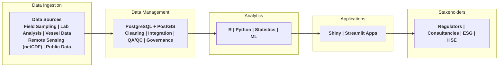
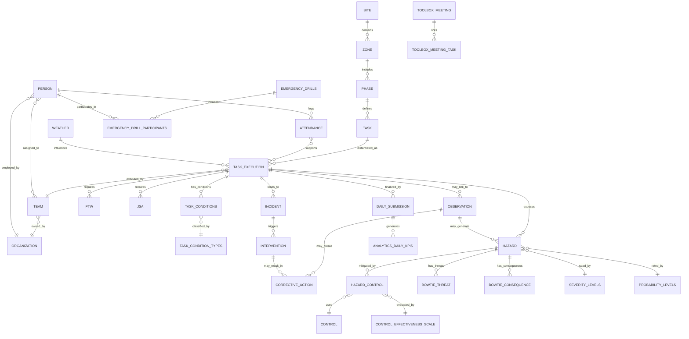

# Hi, I’m Euchie 👋🌱

> I build **risk-aware decision-support systems** that turn complex environmental, spatial, and operational data into **defensible, decision-ready insights**.

Interdisciplinary environmental data scientist and applied risk practitioner working across **environmental systems, spatial analytics, and operational risk (HSE)**.  
Trained in Taiwan and currently based in Saint Lucia, with experience in **regulated and high-uncertainty environments**.
  

---

## 🚀 Featured Project — Biomass Simulator (Climate Risk Tool)

Simulates how squid populations respond to ocean warming scenarios (+2°C default), supporting **fisheries risk assessment and climate-informed planning**.

**What it does:**
- Models biomass response under climate change scenarios  
- Translates long-term fisheries data into predictive insight  
- Supports early-stage ecological risk evaluation  

🔗 [View App](https://squidstock-ocean-dynamics.streamlit.app)

## 🧠 What I Build

I design **decision-support systems under uncertainty**, where:
- data must be validated before use  
- uncertainty is explicit  
- outputs support **real-world decisions**, not just analysis  

---

## 🎓 Background
- Marine Environmental Science + Applied Data Science 
  - MSc Biodiversity — National Taiwan University (Taiwan)
- Originally trained in business, bringing operational insight and analytical rigor to environmental data and decision-support work.
- Currently based in **Saint Lucia**

---

## 💡 What I Do
I design **decision tools**, not just analyses.

That means:
- validating data before interpreting it
- making uncertainty explicit
- translating outputs into **screening-level intelligence** people can actually use

Target environments include:
**environmental consultancies, regulators, NGOs, sustainability teams, and applied data groups**.

---

## 🧩 Decision-Support Architecture
Across projects, I follow a consistent decision-support architecture that emphasizes data credibility, traceability, and operational relevance.

```mermaid
flowchart LR

    %% --- Define subgraphs ---
    subgraph S1["Data Ingestion"]
      A["Data Sources\nField Sampling | Lab Analysis | Vessel Data\nRemote Sensing (netCDF) | Public Data"]
    end

    subgraph S2["Data Management"]
      B["PostgreSQL + PostGIS\nCleaning | Integration | QA/QC | Governance"]
    end

    subgraph S3["Analytics"]
      C["R | Python | Statistics | ML"]
    end

    subgraph S4["Applications"]
      D["Shiny | Streamlit Apps"]
    end

    subgraph S5["Stakeholders"]
      E["Regulators | Consultancies | ESG | HSE"]
    end

    %% --- Define connections ---
    A --> B --> C --> D --> E

    %% --- Increase font size ---
    classDef bigFont font-size:16px, font-family:Arial, font-weight:bold;
    class A,B,C,D,E bigFont;
```
*Turning environmental and operational data into **defensible, decision-ready risk intelligence**.*

---
## 🧠 Decision Intelligence Systems (Projects)

A collection of applied systems designed to support **decision-making under uncertainty** across environmental and operational risk contexts.

## 🦑 SquidStack
**Environmental Contaminants & Human Health Screening**  
Interactive **R Shiny dashboards** translating marine pollution data into **risk-aware insights**.

**Decision flow:**
- QA/QC & data credibility
- Pattern detection & prioritization
- Temporal trend analysis (incl. COVID-era effects)
- Human health screening (EDI / HQ)

[*More about SquidStack*](https://github.com/Euchie23/SquidStack/)  

🔗 Apps:  
- 🧱 [Foundation](https://euchie23.shinyapps.io/foundation/) 
- 🤿 [Exploration](https://euchie23.shinyapps.io/exploration/) 
- 📈 [Fluctuations](https://euchie23.shinyapps.io/fluctuation/) 
- ☣️ [Risk Evaluation](https://euchie23.shinyapps.io/risk_evaluation/)

Used for: screening environmental contamination and translating it into human health risk insights.
  
---

## 📈 SquidStock
**Fisheries Dynamics & Risk-Aware Modeling**  

Python & Streamlit tools supporting **stock assessment and planning under uncertainty**.

Includes:
- CPUE standardization (GAMs, Tweedie)
- Biomass simulation (EDSPM-style models)
- Scenario-aware forecasting
- Exploratory ML with explicit validation limits

[*More about SquidStock*](https://github.com/Euchie23/SquidStock/) 

🔗 Apps / Notebooks:  
- 📈 [Temporal CPUE Analysis](https://github.com/Euchie23/SquidStock/blob/main/notebooks/Temporal_Catch_Analysis/Temporal_Catch_Analysis.ipynb) 
- 📊 [CPUE Standardization & Prediction](https://squidstock-course-correction.streamlit.app) 
- 🌡️ [Biomass Simulation under Warming Scenarios](https://squidstock-ocean-dynamics.streamlit.app)
- ⚙️ [Predictive Squid Catch Models using AutoML](https://squidstock-the-engine-room.streamlit.app)

Used for: stock assessment, effort standardization, and forecasting under environmental and climate variability.

---

## 🌍 GeoTentacles 
**Marine Ecosystem Spatial Intelligence**  

Interactive dashboards turning marine data into actionable insights on hotspots, pollution, and ecosystem health

Highlights:
- 20+ years of spatio-temporal hotspot analysis for fisheries and marine ecosystems
- Machine learning models for **probabilistic hotspot prediction**
- **Marine pollution monitoring** and ecosystem condition analytics
- **Spatial interpolation** and predictive environmental **risk modeling** (e.g., IDW surfaces)
- **Geospatial analytics** built using tools such as **PostGIS, Folium, and interactive web frameworks**
- Interactive applications deployed with scalable cloud databases like **Neon (serverless PostgreSQL)**

[*More about GeoTentacles*](https://github.com/Euchie23/GeoTentacles/)  

🔗 App(s):  
- [🗺️ **Hotspots — Historical and Predicted Squid Catch Hotspots**](<https://euchie23.shinyapps.io/geotentacles__hotspots/>)
- [🌎 **Marine Scope - Your Window into Marine Ecosystem Health**](https://geotentacles-marinescope.streamlit.app)

Used for: identifying ecological hotspots, pollution patterns, and spatial risk distribution in marine systems.

---

## 🦺 HSE–Q Risk Intelligence (Personal Project - In Development)

A **risk intelligence platform for HSE-Q environments**, designed to transform field data into **traceable, automated, and decision-ready safety intelligence** in regulated industrial operations.

**System Components:**

- Relational risk data model (PostgreSQL)  
- Event-driven automation engine (hazards, actions, validations)  
- Advanced risk engine (conditions + controls + barrier integrity)  
- Bowtie-based hazard modeling framework  
- Scenario simulation engine (what-if risk analysis)  
- Guided data entry application (Streamlit)  
- KPI & analytics layer (leading + lagging indicators)  
- AI-ready architecture for future natural language querying  

👉 [How It Works (Simple Overview)](https://github.com/Euchie23/HSEQ_Risk_Intel/blob/main/HOW_IT_WORKS.md)

**Purpose:**  
To structure real-world safety data into **audit-ready, explainable, and predictive operational risk intelligence**.

## 📌 Conceptual Risk Intelligence Model 

Below is a high-level, operational risk intelligence ERD diagram showing how risk information flows through the system.

```mermaid
erDiagram

    SITE ||--o{ ZONE : contains
    ZONE ||--o{ PHASE : includes

    PHASE ||--o{ TASK : defines
    TASK ||--o{ TASK_EXECUTION : instantiated_as

    TASK_EXECUTION }o--|| TEAM : executed_by
    TEAM }o--|| ORGANIZATION : owned_by

    PERSON }o--|| ORGANIZATION : employed_by
    PERSON }o--o{ TEAM : assigned_to

    PERSON ||--o{ ATTENDANCE : logs
    ATTENDANCE }o--o{ TASK_EXECUTION : supports

    TASK_EXECUTION ||--o{ TASK_CONDITIONS : has_conditions
    TASK_CONDITIONS }o--|| TASK_CONDITION_TYPES : classified_by

    TASK_EXECUTION ||--o{ PTW : requires
    TASK_EXECUTION ||--o{ JSA : requires

    TASK_EXECUTION ||--o{ OBSERVATION : may_link_to
    TASK_EXECUTION ||--o{ HAZARD : exposes
    TASK_EXECUTION ||--o{ INCIDENT : leads_to

    OBSERVATION ||--o{ HAZARD : may_generate
    OBSERVATION ||--o{ CORRECTIVE_ACTION : may_create

    HAZARD ||--o{ HAZARD_CONTROL : mitigated_by
    HAZARD ||--o{ BOWTIE_THREAT : has_threats
    HAZARD ||--o{ BOWTIE_CONSEQUENCE : has_consequences

    HAZARD_CONTROL }o--|| CONTROL : uses
    HAZARD_CONTROL }o--|| CONTROL_EFFECTIVENESS_SCALE : evaluated_by

    HAZARD }o--|| SEVERITY_LEVELS : rated_by
    HAZARD }o--|| PROBABILITY_LEVELS : rated_by

    INCIDENT ||--o{ INTERVENTION : triggers
    INTERVENTION ||--o{ CORRECTIVE_ACTION : may_result_in

    TOOLBOX_MEETING ||--o{ TOOLBOX_MEETING_TASK : links

    WEATHER ||--o{ TASK_EXECUTION : influences

    TASK_EXECUTION ||--o{ DAILY_SUBMISSION : finalized_by

    EMERGENCY_DRILLS ||--o{ EMERGENCY_DRILL_PARTICIPANTS : includes
    PERSON ||--o{ EMERGENCY_DRILL_PARTICIPANTS : participates_in

    DAILY_SUBMISSION ||--o{ ANALYTICS_DAILY_KPIS : generates
```

📘 System Logic, Data Entry Rules, and Risk Calculation Methodology
*(See [Database Operations Manual](https://github.com/Euchie23/HSEQ_Risk_Intel/blob/main/docs/Database_Operations_Manual.md) for full implementation guide)*

[*More about HSE-Q Risk Intelligence*](https://github.com/Euchie23/HSEQ_Risk_Intel/)  

---
## ⚠️ Data Governance

All data is anonymized or simulated to ensure compliance with professional and ethical standards.

- Sensitive identifiers are pseudonymized at ingestion  
- Site and organizational details are abstracted  
- Operational structure is preserved without exposing proprietary information  

---

## 🛠 Technical Skills

**Data & Analytics**
- R, Python, SQL, PostgreSQL  
- QA/QC workflows, ETL pipelines  
- Statistical modeling, GAMs, applied ML  

**Spatial Systems**
- PostGIS, QGIS, NetCDF  
- Spatio-temporal analysis & hotspot modeling  

**Dashboards & Tools**
- R Shiny, Streamlit  
- Decision-focused data applications  

---

## 🌱 Domain Experience

- Marine pollution & bioindicators
- Human health exposure screening
- Fisheries stock assessment
- Environmental monitoring systems
- HSE-Q indicators in regulated construction environments

---

## 🧾 Certificates
- 365 Data Science (in progress)
  - [Statistics](https://learn.365datascience.com/certificates/CC-AAD35FAB67/)
  - [Python](https://learn.365datascience.com/certificates/CC-35DE6E8ECC/)
  - [SQL](https://learn.365datascience.com/certificates/CC-8A7C7EED63/)
  - [Machine Learning in Python](https://learn.365datascience.com/certificates/CC-BA4E35B27D/)
- European Energy Centre — Renewable Energy & Energy Efficiency

---

## 🤳 Connect with me:
- 📧 Email: euchiejnpierre@gmail.com  
- 🔗 <a href="https://www.linkedin.com/in/euchiejnpierre/" target="_blank">LinkedIn</a>

---

<strong>📖 About My Work Philosophy</strong>

I don’t optimize for hype or black-box performance.  
I build systems that make **assumptions visible**, **uncertainty explicit**, and **decisions defensible** — especially where environmental and human consequences matter.

